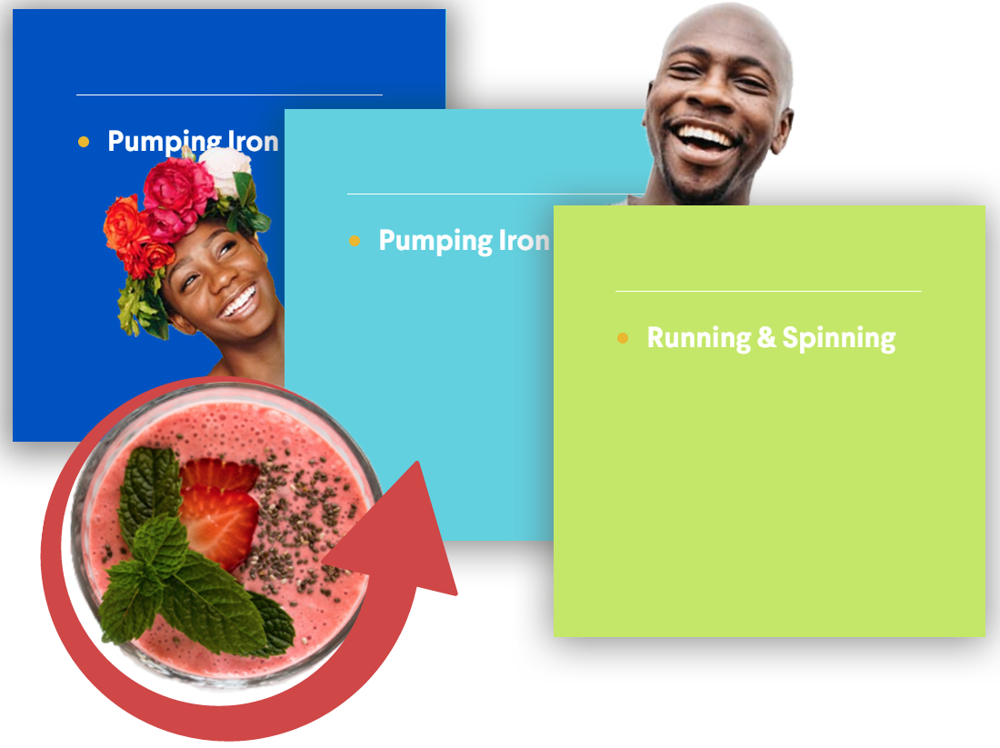

# TRAINING PROJECT
## NAME: THRIVETALK
Screen:

Languages: 
* HTML;
* CSS;
* JS(+JQ);

Properties and technologies: 
* BEM;
* RWD;
* SCSS;
* PUG;
* GULP;
* flex;
* 1 page;
* scroll animation;
* interactive header.